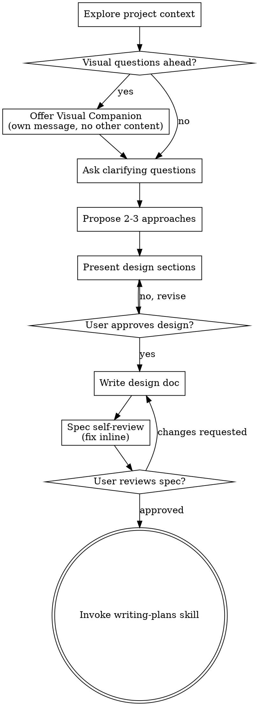

# 将想法头脑风暴为设计

通过自然的协作对话帮助将想法转化为完整的设计和规范。

首先了解当前项目上下文，然后一次提出一个问题来完善想法。一旦你理解了要构建的内容，展示设计并获得用户批准。

<HARD-GATE>
在展示设计并获得用户批准之前，不要调用任何实施技能、编写任何代码、搭建任何项目或采取任何实施行动。这适用于每个项目，无论看起来多么简单。
</HARD-GATE>

## 反模式："这太简单了，不需要设计"

每个项目都要经历这个过程。待办事项列表、单功能实用程序、配置更改——所有这些。"简单"项目是未经检查的假设造成最多浪费工作的地方。设计可以很短（对于真正简单的项目只有几句话），但你必须展示它并获得批准。

## 检查清单

你必须为以下每个项目创建一个任务并按顺序完成：

1. **探索项目上下文**——检查文件、文档、最近的提交
2. **提供视觉配套**（如果主题涉及视觉问题）——这是它自己的消息，不与澄清问题结合。请参阅下面的视觉配套部分。
3. **提出澄清问题**——一次一个，了解目的/约束/成功标准
4. **提出 2-3 种方法**——权衡利弊和你的建议
5. **展示设计**——按复杂程度划分成多个部分，每个部分后获得用户批准
6. **编写设计文档**——保存到 `docs/superpowers/specs/YYYY-MM-DD-<topic>-design.md` 并提交
7. **规范自我审查**——快速内联检查占位符、矛盾、歧义、范围（见下文）
8. **用户审查书面规范**——在继续之前请用户审查规范文件
9. **过渡到实施**——调用编写计划技能来创建实施计划

## 流程

**最终状态是调用 writing-plans。** 不要调用 frontend-design、mcp-builder 或任何其他实施技能。头脑风暴后调用的唯一技能是 writing-plans。

## 流程

**理解想法：**

- 首先查看当前项目状态（文件、文档、最近的提交）
- 在提出详细问题之前，评估范围：如果请求描述了多个独立子系统（例如，"构建一个包含聊天、文件存储、账单和分析的平台"），立即标记出来。不要花费问题来完善一个需要先分解的项目的细节。
- 如果项目对于单个规范来说太大，帮助用户分解成子项目：独立的部分是什么，它们如何关联，应该按什么顺序构建？然后通过正常的设计流程头脑风暴第一个子项目。每个子项目都有自己的规范 → 计划 → 实施周期。
- 对于范围适当的项目，一次提出一个问题来完善想法
- 尽可能使用选择题，但开放式问题也可以
- 每条消息只有一个问题——如果一个主题需要更多探索，将其分解为多个问题
- 专注于理解：目的、约束、成功标准

**探索方法：**

- 提出 2-3 种不同的方法并权衡利弊
- 以对话方式展示选项，包括你的建议和理由
- 首先展示你推荐的选项并解释原因

**展示设计：**

- 一旦你相信你理解了要构建的内容，展示设计
- 按复杂程度调整每个部分：如果简单，几句话；如果细致入微，最多 200-300 字
- 每个部分后询问到目前为止是否看起来正确
- 涵盖：架构、组件、数据流、错误处理、测试
- 准备好回去澄清，如果某些事情没有意义

**为隔离和清晰而设计：**

- 将系统分解为更小的单元，每个单元都有一个明确的目的，通过明确定义的接口进行通信，并且可以独立理解和测试
- 对于每个单元，你应该能够回答：它做什么，你如何使用它，它依赖什么？
- 有人可以在不阅读其内部结构的情况下理解一个单元的作用吗？你可以在不破坏消费者的情况下更改内部结构吗？如果不能，边界需要工作。
- 更小、边界清晰的单元也更容易让你处理——你可以更好地推理你可以一次保存在上下文中的代码，并且当文件集中时你的编辑更可靠。当文件变大时，这通常表明它做了太多事情。

**在现有代码库中工作：**

- 在提议更改之前探索当前结构。遵循现有模式。
- 如果现有代码存在影响工作的问题（例如，文件变得太大、边界不清晰、职责纠缠不清），将有针对性的改进作为设计的一部分包括在内——好的开发人员改进他们正在处理的代码的方式。
- 不要提议不相关的重构。专注于服务于当前目标的内容。

## 设计之后

**文档：**

- 将经过验证的设计（规范）写入 `docs/superpowers/specs/YYYY-MM-DD-<topic>-design.md`
  -（用户对规范位置的偏好覆盖此默认值）
- 如果可用，使用 elements-of-style:writing-clearly-and-concisely 技能
- 将设计文档提交到 git

**规范自我审查：**
编写规范文档后，用新的眼光查看它：

1. **占位符扫描：** 任何 "TBD"、"TODO"、不完整的部分或模糊的需求？修复它们。
2. **内部一致性：** 任何部分是否相互矛盾？架构是否与功能描述匹配？
3. **范围检查：** 这对于单个实施计划来说是否足够集中，还是需要分解？
4. **歧义检查：** 任何需求可以用两种不同的方式解释吗？如果是，选择一个并明确说明。

内联修复任何问题。无需重新审查——只需修复并继续。

**用户审查关卡：**
规范审查循环通过后，请用户在继续之前审查书面规范：

> "规范已编写并提交到 `<path>`。请审查它，如果你想在我们开始编写实施计划之前进行任何更改，请告诉我。"

等待用户的响应。如果他们请求更改，请进行更改并重新运行规范审查循环。只有在用户批准后才能继续。

**实施：**

- 调用 writing-plans 技能来创建详细的实施计划
- 不要调用任何其他技能。writing-plans 是下一步。

## 关键原则

- **一次一个问题**——不要用多个问题压倒
- **首选选择题**——尽可能比开放式问题更容易回答
- **无情地 YAGNI**——从所有设计中删除不必要的功能
- **探索替代方案**——在确定之前总是提出 2-3 种方法
- **增量验证**——展示设计，在继续之前获得批准
- **灵活**——当某些事情没有意义时回去澄清

## 视觉配套

一个基于浏览器的配套，用于在头脑风暴期间展示模型、图表和视觉选项。作为工具可用——不是模式。接受配套意味着它可用于受益于视觉处理的问题；这并不意味着每个问题都通过浏览器。

**提供配套：** 当你预计即将到来的问题将涉及视觉内容（模型、布局、图表）时，提供一次以征得同意：
> "我们正在做的一些事情如果我可以在网络浏览器中向你展示，可能会更容易解释。我可以在进行时组合模型、图表、比较和其他视觉效果。这个功能仍然是新的，并且可能消耗大量 token。想试试吗？（需要打开本地 URL）"

**此提议必须是它自己的消息。** 不要将其与澄清问题、上下文摘要或任何其他内容结合起来。消息应仅包含上述提议，不包含其他内容。在继续之前等待用户的响应。如果他们拒绝，请继续纯文本头脑风暴。

**每个问题的决定：** 即使在用户接受之后，为每个问题决定是使用浏览器还是终端。测试：**用户通过看到它比通过阅读它能更好地理解这一点吗？**

- **使用浏览器**处理视觉内容——模型、线框、布局比较、架构图、并排视觉设计
- **使用终端**处理文本内容——需求问题、概念选择、权衡列表、A/B/C/D 文本选项、范围决策

关于 UI 主题的问题不一定是视觉问题。"在这种情况下，个性是什么意思？"是一个概念问题——使用终端。"哪个向导布局效果更好？"是一个视觉问题——使用浏览器。

如果他们同意配套，请在继续之前阅读详细指南：
`skills/brainstorming/visual-companion.md`
