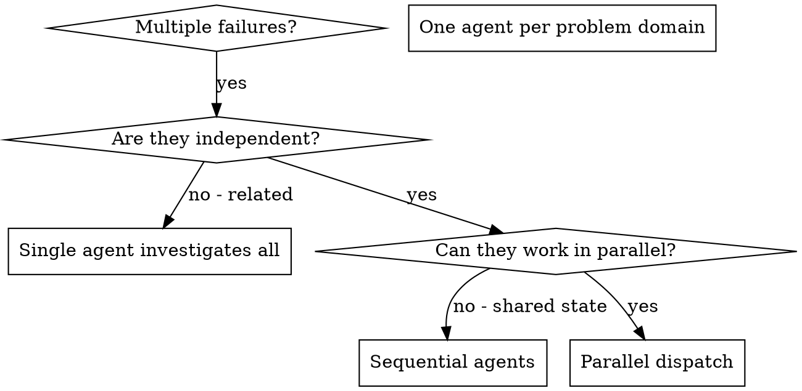

# 调度并行智能体

## 概述

你将任务委托给具有独立上下文的专门智能体。通过精确地构建他们的指令和上下文，你可以确保他们保持专注并成功完成任务。他们永远不应该继承你会话的上下文或历史记录——你需要构建他们所需的确切内容。这也为协调工作保留了你自己的上下文。

当你遇到多个不相关的失败（不同的测试文件、不同的子系统、不同的 bug）时，顺序调查会浪费时间。每个调查都是独立的，可以并行进行。

**核心原则：** 为每个独立问题域分派一个智能体。让他们同时工作。

## 何时使用



**使用时机：**
- 3 个以上测试文件因不同的根本原因失败
- 多个子系统独立损坏
- 每个问题都可以在不了解其他问题上下文的情况下理解
- 调查之间没有共享状态

**不要使用当：**
- 失败是相关的（修复一个可能会修复其他的）
- 需要了解完整系统状态
- 智能体会相互干扰

## 模式

### 1. 识别独立领域

按损坏的内容分组失败：
- 文件 A 测试：工具审批流程
- 文件 B 测试：批量完成行为
- 文件 C 测试：中止功能

每个领域都是独立的——修复工具审批不会影响中止测试。

### 2. 创建专注的智能体任务

每个智能体获得：
- **具体范围：** 一个测试文件或子系统
- **明确目标：** 让这些测试通过
- **约束：** 不要更改其他代码
- **预期输出：** 你发现和修复的内容摘要

### 3. 并行调度

```typescript
// 在 Claude Code / AI 环境中
Task("Fix agent-tool-abort.test.ts failures")
Task("Fix batch-completion-behavior.test.ts failures")
Task("Fix tool-approval-race-conditions.test.ts failures")
// 三者同时运行
```

### 4. 审查和集成

当智能体返回时：
- 阅读每个摘要
- 验证修复没有冲突
- 运行完整的测试套件
- 集成所有更改

## 智能体提示结构

好的智能体提示是：
1. **专注的** - 一个明确的问题域
2. **自包含的** - 理解问题所需的所有上下文
3. **明确的输出** - 智能体应该返回什么？

```markdown
修复 src/agents/agent-tool-abort.test.ts 中 3 个失败的测试：

1. "should abort tool with partial output capture" - 期望消息中包含 'interrupted at'
2. "should handle mixed completed and aborted tools" - 快速工具被中止而不是完成
3. "should properly track pendingToolCount" - 期望 3 个结果但得到 0

这些是时序/竞争条件问题。你的任务：

1. 阅读测试文件，理解每个测试验证的内容
2. 识别根本原因——是时序问题还是实际 bug？
3. 通过以下方式修复：
   - 用基于事件的等待替换任意超时
   - 如果发现中止实现中的 bug 则修复
   - 如果测试行为更改则调整测试期望

不要只是增加超时——找到真正的问题。

返回：你发现和修复的内容摘要。
```

## 常见错误

**❌ 太宽泛：** "Fix all the tests" - 智能体会迷路
**✅ 具体：** "Fix agent-tool-abort.test.ts" - 专注的范围

**❌ 无上下文：** "Fix the race condition" - 智能体不知道在哪里
**✅ 上下文：** 粘贴错误消息和测试名称

**❌ 无约束：** 智能体可能重构所有内容
**✅ 约束：** "不要更改生产代码"或"仅修复测试"

**❌ 模糊输出：** "Fix it" - 你不知道发生了什么变化
**✅ 具体：** "返回根本原因和更改的摘要"

## 何时不使用

**相关失败：** 修复一个可能会修复其他的——先一起调查
**需要完整上下文：** 理解需要查看整个系统
**探索性调试：** 你还不知道哪里坏了
**共享状态：** 智能体会相互干扰（编辑相同的文件，使用相同的资源）

## 会话中的真实示例

**场景：** 大型重构后，3 个文件中有 6 个测试失败

**失败：**
- agent-tool-abort.test.ts：3 个失败（时序问题）
- batch-completion-behavior.test.ts：2 个失败（工具未执行）
- tool-approval-race-conditions.test.ts：1 个失败（执行计数 = 0）

**决策：** 独立领域——中止逻辑与批量完成分离，与竞争条件分离

**调度：**
```
智能体 1 → 修复 agent-tool-abort.test.ts
智能体 2 → 修复 batch-completion-behavior.test.ts
智能体 3 → 修复 tool-approval-race-conditions.test.ts
```

**结果：**
- 智能体 1：用基于事件的等待替换了超时
- 智能体 2：修复了事件结构 bug（threadId 位置错误）
- 智能体 3：添加了等待异步工具执行完成的代码

**集成：** 所有修复都是独立的，没有冲突，完整套件通过

**节省时间：** 3 个问题并行解决与顺序解决

## 关键优势

1. **并行化** - 多个调查同时进行
2. **专注** - 每个智能体范围狭窄，需要跟踪的上下文更少
3. **独立性** - 智能体不会相互干扰
4. **速度** - 在 1 个问题的时间内解决 3 个问题

## 验证

智能体返回后：
1. **审查每个摘要** - 理解发生了什么变化
2. **检查冲突** - 智能体是否编辑了相同的代码？
3. **运行完整套件** - 验证所有修复一起工作
4. **抽查** - 智能体可能会犯系统性错误

## 真实世界影响

来自调试会话（2025-10-03）：
- 3 个文件中的 6 个失败
- 并行调度 3 个智能体
- 所有调查同时完成
- 所有修复成功集成
- 智能体更改之间零冲突
