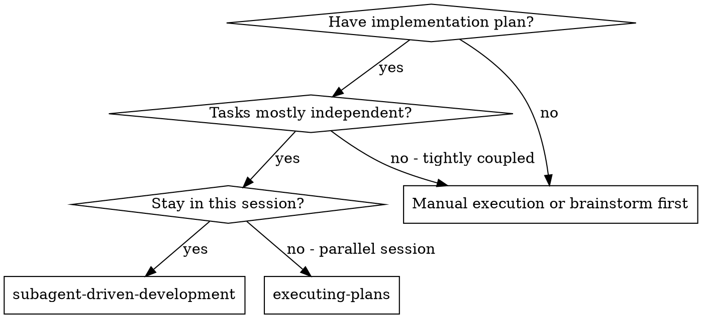
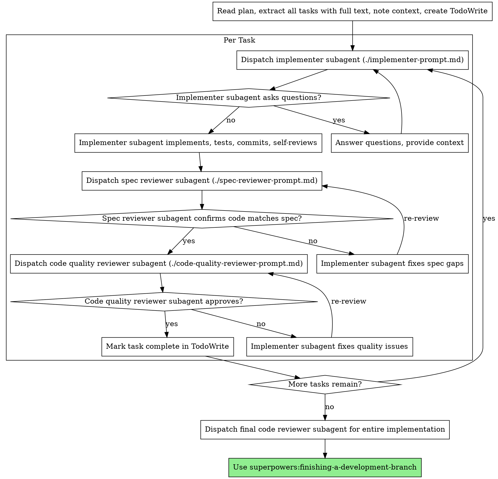

# 子智能体驱动开发

通过为每个任务调度新的子智能体来执行计划，每个任务后进行两阶段审查：首先是规范合规性审查，然后是代码质量审查。

**为什么使用子智能体：** 你将任务委托给具有独立上下文的专门智能体。通过精确地构建他们的指令和上下文，你可以确保他们保持专注并成功完成任务。他们永远不应该继承你会话的上下文或历史记录——你需要构建他们所需的确切内容。这也为协调工作保留了你自己的上下文。

**核心原则：** 每个任务使用新的子智能体 + 两阶段审查（规范然后质量）= 高质量、快速迭代

## 何时使用



**与执行计划（并行会话）相比：**
- 同一会话（无上下文切换）
- 每个任务使用新的子智能体（无上下文污染）
- 每个任务后两阶段审查：首先规范合规性，然后代码质量
- 更快的迭代（任务之间无需人工参与）

## 流程



## 模型选择

使用可以处理每个角色的功能最弱的模型来节省成本并提高速度。

**机械实施任务**（独立函数、清晰规范、1-2 个文件）：使用快速、廉价的模型。当计划规范良好时，大多数实施任务都是机械的。

**集成和判断任务**（多文件协调、模式匹配、调试）：使用标准模型。

**架构、设计和审查任务**：使用功能最强大的可用模型。

**任务复杂度信号：**
- 涉及 1-2 个文件且规范完整 → 廉价模型
- 涉及多个文件且有集成问题 → 标准模型
- 需要设计判断或广泛的代码库理解 → 功能最强大的模型

## 处理实施者状态

实施者子智能体报告四种状态之一。适当地处理每个状态：

**DONE：** 继续进行规范合规性审查。

**DONE_WITH_CONCERNS：** 实施者完成了工作但标记了疑虑。在继续之前阅读疑虑。如果疑虑是关于正确性或范围的，在审查前解决它们。如果它们是观察结果（例如，"这个文件正在变大"），记下它们并继续审查。

**NEEDS_CONTEXT：** 实施者需要未提供的信息。提供缺失的上下文并重新调度。

**BLOCKED：** 实施者无法完成任务。评估阻碍：
1. 如果是上下文问题，提供更多上下文并使用相同模型重新调度
2. 如果任务需要更多推理，使用功能更强大的模型重新调度
3. 如果任务太大，将其分解成更小的部分
4. 如果计划本身是错误的，升级到人类

**永远不要** 忽略升级或强制相同模型在没有更改的情况下重试。如果实施者说卡住了，有些东西需要改变。

## 提示模板

- `./implementer-prompt.md` - 调度实施者子智能体
- `./spec-reviewer-prompt.md` - 调度规范合规性审查者子智能体
- `./code-quality-reviewer-prompt.md` - 调度代码质量审查者子智能体

## 示例工作流

```
你：我正在使用子智能体驱动开发来执行这个计划。

[读取一次计划文件：docs/superpowers/plans/feature-plan.md]
[提取所有 5 个任务，包含完整文本和上下文]
[创建包含所有任务的 TodoWrite]

任务 1：钩子安装脚本

[获取任务 1 文本和上下文（已提取）]
[调度带有完整任务文本 + 上下文的实施子智能体]

实施者："在我开始之前——钩子应该安装在用户级别还是系统级别？"

你："用户级别 (~/.config/superpowers/hooks/)"

实施者："明白了。现在实施..."
[稍后] 实施者：
  - 已实现 install-hook 命令
  - 添加了测试，5/5 通过
  - 自我审查：发现我遗漏了 --force 标志，已添加
  - 已提交

[调度规范合规性审查者]
规范审查者：✅ 规范合规——所有要求都已满足，没有多余内容

[获取 git SHA，调度代码质量审查者]
代码审查者：优势：良好的测试覆盖，清晰。问题：无。已批准。

[标记任务 1 完成]

任务 2：恢复模式

[获取任务 2 文本和上下文（已提取）]
[调度带有完整任务文本 + 上下文的实施子智能体]

实施者：[无问题，继续]
实施者：
  - 添加了验证/修复模式
  - 8/8 测试通过
  - 自我审查：一切良好
  - 已提交

[调度规范合规性审查者]
规范审查者：❌ 问题：
  - 缺失：进度报告（规范说"每 100 项报告"）
  - 多余：添加了 --json 标志（未请求）

[实施者修复问题]
实施者：删除了 --json 标志，添加了进度报告

[规范审查者再次审查]
规范审查者：✅ 现在规范合规

[调度代码质量审查者]
代码审查者：优势：可靠。问题（重要）：魔法数字 (100)

[实施者修复]
实施者：提取了 PROGRESS_INTERVAL 常量

[代码审查者再次审查]
代码审查者：✅ 已批准

[标记任务 2 完成]

...

[所有任务后]
[调度最终代码审查者]
最终审查者：所有要求都已满足，准备合并

完成！
```

## 优势

**与手动执行相比：**
- 子智能体自然遵循 TDD
- 每个任务使用新上下文（无混淆）
- 并行安全（子智能体不会干扰）
- 子智能体可以（在工作之前**和**期间）询问问题

**与执行计划相比：**
- 同一会话（无交接）
- 连续进度（无等待）
- 自动审查检查点

**效率提升：**
- 无文件读取开销（控制器提供完整文本）
- 控制器精确管理所需的上下文
- 子智能体预先获得完整信息
- 问题在工作开始前浮出水面（不是之后）

**质量门：**
- 自我审查在交接前捕获问题
- 两阶段审查：规范合规性，然后代码质量
- 审查循环确保修复实际有效
- 规范合规性防止过度/不足构建
- 代码质量确保实施构建良好

**成本：**
- 更多子智能体调用（每个任务：实施者 + 2 个审查者）
- 控制器做更多准备工作（预先提取所有任务）
- 审查循环添加迭代
- 但尽早捕获问题（比以后调试更便宜）

## 红色警告

**永远不要：**
- 未经用户明确同意在 main/master 分支上开始实施
- 跳过审查（规范合规性**或**代码质量）
- 带着未修复的问题继续
- 并行调度多个实施子智能体（冲突）
- 让子智能体读取计划文件（而是提供完整文本）
- 跳过场景设置上下文（子智能体需要理解任务的位置）
- 忽略子智能体问题（让他们继续前先回答）
- 接受规范合规性"接近"（规范审查者发现问题 = 未完成）
- 跳过审查循环（审查者发现问题 = 实施者修复 = 再次审查）
- 让实施者自我审查取代实际审查（两者都需要）
- **在规范合规性为 ✅ 之前开始代码质量审查**（顺序错误）
- 当任一审查有未解决的问题时移动到下一个任务

**如果子智能体询问问题：**
- 清晰完整地回答
- 如有需要提供额外上下文
- 不要催促他们实施

**如果审查者发现问题：**
- 实施者（同一个子智能体）修复它们
- 审查者再次审查
- 重复直到批准
- 不要跳过重新审查

**如果子智能体未能完成任务：**
- 调度带有具体指令的修复子智能体
- 不要尝试手动修复（上下文污染）

## 集成

**所需的工作流技能：**
- **superpowers:using-git-worktrees** - 必需：在开始前设置隔离的工作区
- **superpowers:writing-plans** - 创建此技能执行的计划
- **superpowers:requesting-code-review** - 审查者子智能体的代码审查模板
- **superpowers:finishing-a-development-branch** - 在所有任务后完成开发

**子智能体应该使用：**
- **superpowers:test-driven-development** - 子智能体为每个任务遵循 TDD

**替代工作流：**
- **superpowers:executing-plans** - 用于并行会话而不是同一会话执行
