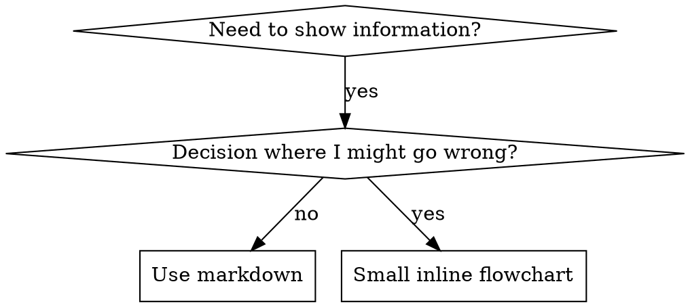

# 编写技能

## 概述

**编写技能就是应用于流程文档的测试驱动开发。**

**个人技能存在于智能体特定的目录中（Claude Code 为 `~/.claude/skills`，Codex 为 `~/.agents/skills/`）**

你编写测试用例（带有子智能体的压力场景），看着它们失败（基线行为），编写技能（文档），看着测试通过（智能体遵守），并重构（关闭漏洞）。

**核心原则：** 如果你没有看着智能体在没有技能的情况下失败，你就不知道技能是否教了正确的东西。

**必需的背景：** 在使用此技能之前，你必须理解 superpowers:test-driven-development。该技能定义了基本的 RED-GREEN-REFACTOR 循环。此技能将 TDD 应用于文档。

**官方指南：** 有关 Anthropic 的官方技能创作最佳实践，请参阅 anthropic-best-practices.md。此文档提供了补充此技能中以 TDD 为中心的方法的其他模式和指南。

## 什么是技能？

**技能**是经过验证的技术、模式或工具的参考指南。技能帮助未来的 Claude 实例找到并应用有效的方法。

**技能是：** 可重用的技术、模式、工具、参考指南

**技能不是：** 关于你如何一次解决问题的叙述

## 技能的 TDD 映射

| TDD 概念 | 技能创建 |
|-------------|----------------|
| **测试用例** | 带有子智能体的压力场景 |
| **生产代码** | 技能文档 (SKILL.md) |
| **测试失败 (RED)** | 智能体在没有技能的情况下违反规则（基线） |
| **测试通过 (GREEN)** | 智能体在存在技能的情况下遵守 |
| **重构** | 在保持合规的同时关闭漏洞 |
| **先写测试** | 在编写技能之前运行基线场景 |
| **看着它失败** | 记录智能体使用的确切合理化 |
| **最小代码** | 编写解决那些特定违规的技能 |
| **看着它通过** | 验证智能体现在遵守 |
| **重构循环** | 找到新的合理化 → 堵住 → 重新验证 |

整个技能创建过程遵循 RED-GREEN-REFACTOR。

## 何时创建技能

**在以下情况下创建：**
- 技术对你来说不是直观明显的
- 你会在项目中再次引用这个
- 模式广泛适用（不是项目特定的）
- 其他人会受益

**不要为以下情况创建：**
- 一次性解决方案
- 其他地方有充分文档记录的标准实践
- 项目特定的约定（放在 CLAUDE.md 中）
- 机械约束（如果可以用正则表达式/验证强制执行，自动化它——将文档保存用于判断调用）

## 技能类型

### 技术
有要遵循的步骤的具体方法（基于条件的等待、根本原因跟踪）

### 模式
思考问题的方式（用标志扁平化、测试不变量）

### 参考
API 文档、语法指南、工具文档（office docs）

## 目录结构


```
skills/
  skill-name/
    SKILL.md              # 主要参考（必需）
    supporting-file.*     # 仅在需要时
```

**扁平命名空间** - 所有技能都在一个可搜索的命名空间中

**为以下情况单独文件：**
1. **大量参考**（100+ 行）——API 文档、全面的语法
2. **可重用工具**——脚本、实用程序、模板

**保持内联：**
- 原则和概念
- 代码模式（< 50 行）
- 其他所有内容

## SKILL.md 结构

**前言（YAML）：**
- 两个必需字段：`name` 和 `description`（请参阅 [agentskills.io/specification](https://agentskills.io/specification) 以获取所有支持的字段）
- 最多 1024 个字符
- `name`：仅使用字母、数字和连字符（无括号、特殊字符）
- `description`：第三人称，仅描述**何时使用**（不描述它做什么）
  - 以"Use when..."开头以专注于触发条件
  - 包含具体的症状、情况和上下文
  - **永远不要总结技能的流程或工作流**（请参阅 CSO 部分了解原因）
  - 如果可能，保持在 500 个字符以下

```markdown
---
name: Skill-Name-With-Hyphens
description: Use when [specific triggering conditions and symptoms]
---

# 技能名称

## 概述
这是什么？1-2 句话的核心原则。

## 何时使用
[如果决策不明显，则使用小型内联流程图]

带有症状和用例的项目符号列表
何时不使用

## 核心模式（用于技术/模式）
前后代码比较

## 快速参考
用于扫描常见操作的表格或项目符号

## 实施
用于简单模式的内联代码
用于大量参考或可重用工具的文件链接

## 常见错误
什么出错了 + 修复

## 真实世界影响（可选）
具体结果
```


## Claude 搜索优化 (CSO)

**对发现至关重要：** 未来的 Claude 需要找到你的技能

### 1. 丰富的描述字段

**目的：** Claude 阅读描述以决定为给定任务加载哪些技能。让它回答："我现在应该阅读这个技能吗？"

**格式：** 以"Use when..."开头以专注于触发条件

**关键：描述 = 何时使用，而不是技能做什么**

描述应该只描述触发条件。不要在描述中总结技能的流程或工作流。

**为什么这很重要：** 测试表明，当描述总结技能的工作流时，Claude 可能会遵循描述而不是阅读完整的技能内容。一个说"任务之间的代码审查"的描述导致 Claude 做了一次审查，即使技能的流程图清楚地显示了两次审查（规范合规性然后代码质量）。

当描述更改为仅"当在当前会话中执行具有独立任务的实施计划时使用"（无工作流摘要）时，Claude 正确地阅读了流程图并遵循了两阶段审查过程。

**陷阱：** 总结工作流的描述创造了 Claude 会走的捷径。技能主体变成 Claude 跳过的文档。

```yaml
# ❌ 错误：总结工作流——Claude 可能会遵循这个而不是阅读技能
description: Use when executing plans - dispatches subagent per task with code review between tasks

# ❌ 错误：太多流程细节
description: Use for TDD - write test first, watch it fail, write minimal code, refactor

# ✅ 好：只是触发条件，没有工作流摘要
description: Use when executing implementation plans with independent tasks in the current session

# ✅ 好：仅触发条件
description: Use when implementing any feature or bugfix, before writing implementation code
```

**内容：**
- 使用具体的触发器、症状和表明此技能适用的情况
- 描述*问题*（竞争条件、不一致行为）而不是*语言特定症状*（setTimeout、sleep）
- 保持触发器与技术无关，除非技能本身是技术特定的
- 如果技能是技术特定的，在触发器中明确说明
- 以第三人称书写（注入系统提示）
- **永远不要总结技能的流程或工作流**

```yaml
# ❌ 错误：太抽象、模糊，不包含何时使用
description: For async testing

# ❌ 错误：第一人称
description: I can help you with async tests when they're flaky

# ❌ 错误：提到技术但技能不是特定于它的
description: Use when tests use setTimeout/sleep and are flaky

# ✅ 好：以"Use when"开头，描述问题，无工作流
description: Use when tests have race conditions, timing dependencies, or pass/fail inconsistently

# ✅ 好：具有明确触发器的技术特定技能
description: Use when using React Router and handling authentication redirects
```

### 2. 关键字覆盖

使用 Claude 会搜索的词：
- 错误消息："Hook timed out"、"ENOTEMPTY"、"race condition"
- 症状："flaky"、"hanging"、"zombie"、"pollution"
- 同义词："timeout/hang/freeze"、"cleanup/teardown/afterEach"
- 工具：实际命令、库名称、文件类型

### 3. 描述性命名

**使用主动语态，动词优先：**
- ✅ `creating-skills` 而不是 `skill-creation`
- ✅ `condition-based-waiting` 而不是 `async-test-helpers`

### 4. Token 效率（关键）

**问题：** 入门和经常引用的技能加载到每个对话中。每个 token 都很重要。

**目标字数：**
- 入门工作流：每个 < 150 字
- 经常加载的技能：总共 < 200 字
- 其他技能：< 500 字（仍然简洁）

**技术：**

**将详细信息移到工具帮助：**
```bash
# ❌ 错误：在 SKILL.md 中记录所有标志
search-conversations supports --text, --both, --after DATE, --before DATE, --limit N

# ✅ 好：参考 --help
search-conversations supports multiple modes and filters. Run --help for details.
```

**使用交叉引用：**
```markdown
# ❌ 错误：重复工作流细节
搜索时，使用模板调度子智能体...
[20 行重复说明]

# ✅ 好：参考其他技能
始终使用子智能体（节省 50-100 倍上下文）。必需：使用 [other-skill-name] 进行工作流。
```

**压缩示例：**
```markdown
# ❌ 错误：冗长示例（42 字）
你的人类合作伙伴："我们之前在 React Router 中是如何处理身份验证错误的？"
你：我将搜索过去的 React Router 身份验证模式对话。
[调度带有搜索查询的子智能体："React Router authentication error handling 401"]

# ✅ 好：最小示例（20 字）
合作伙伴："我们之前在 React Router 中是如何处理身份验证错误的？"
你：搜索中...
[调度子智能体 → 综合]
```

**消除冗余：**
- 不要重复交叉引用技能中的内容
- 不要解释从命令中显而易见的内容
- 不要包含相同模式的多个示例

**验证：**
```bash
wc -w skills/path/SKILL.md
# 入门工作流：目标 < 150 每个
# 其他经常加载的：目标 < 200 总共
```

**按你做的事情或核心见解命名：**
- ✅ `condition-based-waiting` > `async-test-helpers`
- ✅ `using-skills` 而不是 `skill-usage`
- ✅ `flatten-with-flags` > `data-structure-refactoring`
- ✅ `root-cause-tracing` > `debugging-techniques`

**动名词 (-ing) 对流程很有效：**
- `creating-skills`、`testing-skills`、`debugging-with-logs`
- 主动，描述你正在采取的行动

### 4. 交叉引用其他技能

**当编写引用其他技能的文档时：**

仅使用技能名称，带有明确的要求标记：
- ✅ 好：`**必需的子技能：** 使用 superpowers:test-driven-development`
- ✅ 好：`**必需的背景：** 你必须理解 superpowers:systematic-debugging`
- ❌ 错误：`参见 skills/testing/test-driven-development`（不清楚是否需要）
- ❌ 错误：`@skills/testing/test-driven-development/SKILL.md`（强制加载，消耗上下文）

**为什么不使用 @ 链接：** `@` 语法会立即强制加载文件，在你需要它们之前消耗 200k+ 上下文。

## 流程图使用



**仅在以下情况下使用流程图：**
- 不明显的决策点
- 你可能过早停止的流程循环
- "何时使用 A 与 B"决策

**永远不要在以下情况下使用流程图：**
- 参考材料 → 表格、列表
- 代码示例 → Markdown 块
- 线性指令 → 编号列表
- 没有语义意义的标签（step1、helper2）

请参阅 @graphviz-conventions.dot 以获取 graphviz 样式规则。

**为你的人类合作伙伴可视化：** 使用此目录中的 `render-graphs.js` 将技能的流程图渲染为 SVG：
```bash
./render-graphs.js ../some-skill           # 每个图表单独
./render-graphs.js ../some-skill --combine # 所有图表在一个 SVG 中
```

## 代码示例

**一个优秀的示例胜过许多平庸的示例**

选择最相关的语言：
- 测试技术 → TypeScript/JavaScript
- 系统调试 → Shell/Python
- 数据处理 → Python

**好的示例：**
- 完整且可运行
- 注释充分解释**为什么**
- 来自真实场景
- 清晰展示模式
- 准备好适应（不是通用模板）

**不要：**
- 用 5+ 种语言实施
- 创建填空模板
- 写人为的示例

你擅长移植——一个好的示例就足够了。

## 文件组织

### 自包含的技能
```
defense-in-depth/
  SKILL.md    # 一切内联
```
何时：所有内容都适合，不需要大量参考

### 带有可重用工具的技能
```
condition-based-waiting/
  SKILL.md    # 概述 + 模式
  example.ts  # 可适应的工作辅助函数
```
何时：工具是可重用代码，而不仅仅是叙述

### 带有大量参考的技能
```
pptx/
  SKILL.md       # 概述 + 工作流
  pptxgenjs.md   # 600 行 API 参考
  ooxml.md       # 500 行 XML 结构
  scripts/       # 可执行工具
```
何时：参考材料太大而无法内联

## 铁律（与 TDD 相同）

```
没有先失败的测试就不要技能
```

这适用于新技能**和**对现有技能的编辑。

在测试之前写技能？删除它。重新开始。

编辑技能而不测试？同样的违规。

**没有例外：**
- 不是为了"简单的添加"
- 不是为了"只是添加一个部分"
- 不是为了"文档更新"
- 不要保留未经测试的更改作为"参考"
- 不要在运行测试时"调整"它
- 删除意味着删除

**必需的背景：** superpowers:test-driven-development 技能解释了为什么这很重要。同样的原则适用于文档。

## 测试所有技能类型

不同的技能类型需要不同的测试方法：

### 纪律执行技能（规则/要求）

**示例：** TDD、完成前验证、编码前设计

**测试方法：**
- 学术问题：他们理解规则吗？
- 压力场景：他们在压力下遵守吗？
- 多种压力组合：时间 + 沉没成本 + 疲惫
- 识别合理化并添加明确的对策

**成功标准：** 智能体在最大压力下遵守规则

### 技术技能（操作指南）

**示例：** 基于条件的等待、根本原因跟踪、防御性编程

**测试方法：**
- 应用场景：他们能正确应用技术吗？
- 变化场景：他们处理边缘情况吗？
- 缺失信息测试：说明有差距吗？

**成功标准：** 智能体成功将技术应用于新场景

### 模式技能（心理模型）

**示例：** 降低复杂性、信息隐藏概念

**测试方法：**
- 识别场景：他们识别模式何时适用吗？
- 应用场景：他们能使用心理模型吗？
- 反示例：他们知道何时**不**应用吗？

**成功标准：** 智能体正确识别何时/如何应用模式

### 参考技能（文档/API）

**示例：** API 文档、命令参考、库指南

**测试方法：**
- 检索场景：他们能找到正确的信息吗？
- 应用场景：他们能正确使用找到的内容吗？
- 差距测试：常见用例被覆盖吗？

**成功标准：** 智能体找到并正确应用参考信息

## 跳过测试的常见合理化

| 借口 | 现实 |
|--------|---------|
| "技能显然很清楚" | 对你清楚 ≠ 对其他智能体清楚。测试它。 |
| "这只是一个参考" | 参考可能有差距、不清楚的部分。测试检索。 |
| "测试是过度杀伤" | 未经测试的技能总是有问题。15 分钟测试节省数小时。 |
| "如果问题出现我会测试" | 问题 = 智能体无法使用技能。在部署前测试。 |
| "测试太乏味" | 测试比在生产中调试坏技能更乏味。 |
| "我有信心它很好" | 过度自信保证会有问题。无论如何测试。 |
| "学术审查就足够了" | 阅读 ≠ 使用。测试应用场景。 |
| "没有时间测试" | 部署未经测试的技能以后修复它会浪费更多时间。 |

**所有这些都意味着：在部署前测试。没有例外。**

## 针对合理化强化技能

执行纪律的技能（如 TDD）需要抵制合理化。智能体很聪明，在压力下会找到漏洞。

**心理学注意：** 理解**为什么**说服技术有效有助于你系统地应用它们。有关研究基础（Cialdini，2021；Meincke 等人，2025）关于权威、承诺、稀缺、社会认同和统一原则，请参阅 persuasion-principles.md。

### 明确关闭每个漏洞

不要只陈述规则——禁止具体的变通方法：

<坏>
```markdown
在测试之前写代码？删除它。
```
</坏>

<好>
```markdown
在测试之前写代码？删除它。重新开始。

**没有例外：**
- 不要把它作为"参考"保留
- 不要在写测试时"调整"它
- 不要看它
- 删除意味着删除
```
</好>

### 解决"精神与文字"论点

尽早添加基础原则：

```markdown
**违反规则的文字就是违反规则的精神。**
```

这切断了整类"我遵循精神"的合理化。

### 构建合理化表

从基线测试中捕获合理化（请参阅下面的测试部分）。智能体提出的每个借口都放在表中：

```markdown
| 借口 | 现实 |
|--------|---------|
| "太简单不需要测试" | 简单代码会坏。测试需要 30 秒。 |
| "我会之后测试" | 测试立即通过什么也证明不了。 |
| "之后测试实现相同目标" | 之后测试 = "这做什么？" 优先测试 = "这应该做什么？" |
```

### 创建红色警告列表

让智能体在合理化时容易自我检查：

```markdown
## 红色警告——停止并重新开始

- 测试前有代码
- "我已经手动测试了"
- "之后测试实现相同目的"
- "这是关于精神而不是仪式"
- "这不同因为..."

**所有这些都意味着：删除代码。用 TDD 重新开始。**
```

### 为违规症状更新 CSO

添加到描述：你即将违反规则时的症状：

```yaml
description: use when implementing any feature or bugfix, before writing implementation code
```

## 技能的 RED-GREEN-REFACTOR

遵循 TDD 循环：

### RED：编写失败的测试（基线）

在**没有**技能的情况下运行带有子智能体的压力场景。记录确切的行为：
- 他们做出了什么选择？
- 他们使用了什么合理化（逐字）？
- 什么压力触发了违规？

这是"看着测试失败"——你必须在编写技能之前看到智能体自然会做什么。

### GREEN：编写最小技能

编写解决那些特定合理化的技能。不要为假设情况添加额外内容。

**使用**技能运行相同的场景。智能体现在应该遵守。

### REFACTOR：关闭漏洞

智能体找到了新的合理化？添加明确的对策。重新测试直到无懈可击。

**测试方法：** 有关完整的测试方法，请参阅 @testing-skills-with-subagents.md：
- 如何编写压力场景
- 压力类型（时间、沉没成本、权威、疲惫）
- 系统地堵住漏洞
- 元测试技术

## 反模式

### ❌ 叙述性示例
"在 2025-10-03 会话中，我们发现空的 projectDir 导致..."
**为什么不好：** 太具体，不可重用

### ❌ 多语言稀释
example-js.js、example-py.py、example-go.go
**为什么不好：** 平庸的质量，维护负担

### ❌ 流程图中的代码
```dot
step1 [label="import fs"];
step2 [label="read file"];
```
**为什么不好：** 无法复制粘贴，难以阅读

### ❌ 通用标签
helper1、helper2、step3、pattern4
**为什么不好：** 标签应该有语义意义

## 停止：在移动到下一个技能之前

**编写任何技能后，你必须停止并完成部署过程。**

**不要：**
- 批量创建多个技能而不测试每个
- 在当前技能验证之前移动到下一个技能
- 因为"批量更有效"而跳过测试

**下面的部署清单对每个技能都是强制性的。**

部署未经测试的技能 = 部署未经测试的代码。这违反了质量标准。

## 技能创建清单（TDD 改编）

**重要：使用 TodoWrite 为下面的每个清单项创建待办事项。**

**RED 阶段——编写失败的测试：**
- [ ] 创建压力场景（纪律技能需要 3+ 种组合压力）
- [ ] 在没有技能的情况下运行场景——逐字记录基线行为
- [ ] 识别合理化/失败中的模式

**GREEN 阶段——编写最小技能：**
- [ ] 名称仅使用字母、数字、连字符（无括号/特殊字符）
- [ ] 带有必需的 `name` 和 `description` 字段的 YAML 前言（最多 1024 个字符；请参阅 [规范](https://agentskills.io/specification)）
- [ ] 描述以"Use when..."开头并包含具体的触发器/症状
- [ ] 描述以第三人称书写
- [ ] 全文中的关键字用于搜索（错误、症状、工具）
- [ ] 带有核心原则的清晰概述
- [ ] 解决在 RED 中识别的特定基线失败
- [ ] 内联代码**或**链接到单独的文件
- [ ] 一个优秀的示例（不是多语言）
- [ ] 使用技能运行场景——验证智能体现在遵守

**REFACTOR 阶段——关闭漏洞：**
- [ ] 从测试中识别新的合理化
- [ ] 添加明确的对策（如果是纪律技能）
- [ ] 从所有测试迭代构建合理化表
- [ ] 创建红色警告列表
- [ ] 重新测试直到无懈可击

**质量检查：**
- [ ] 仅在决策不明显时使用小型流程图
- [ ] 快速参考表
- [ ] 常见错误部分
- [ ] 没有叙述性故事讲述
- [ ] 仅用于工具或大量参考的支持文件

**部署：**
- [ ] 将技能提交到 git 并推送到你的 fork（如果已配置）
- [ ] 考虑通过 PR 回馈（如果广泛有用）

## 发现工作流

未来的 Claude 如何找到你的技能：

1. **遇到问题**（"测试不稳定"）
3. **找到技能**（描述匹配）
4. **扫描概述**（这相关吗？）
5. **阅读模式**（快速参考表）
6. **加载示例**（仅在实施时）

**为此流程优化**——尽早并经常放置可搜索的术语。

## 底线

**创建技能就是流程文档的 TDD。**

相同的铁律：没有先失败的测试就没有技能。
相同的循环：RED（基线）→ GREEN（编写技能）→ REFACTOR（关闭漏洞）。
相同的好处：更好的质量，更少的意外，无懈可击的结果。

如果你遵循代码的 TDD，就遵循技能的 TDD。这是应用于文档的相同纪律。
